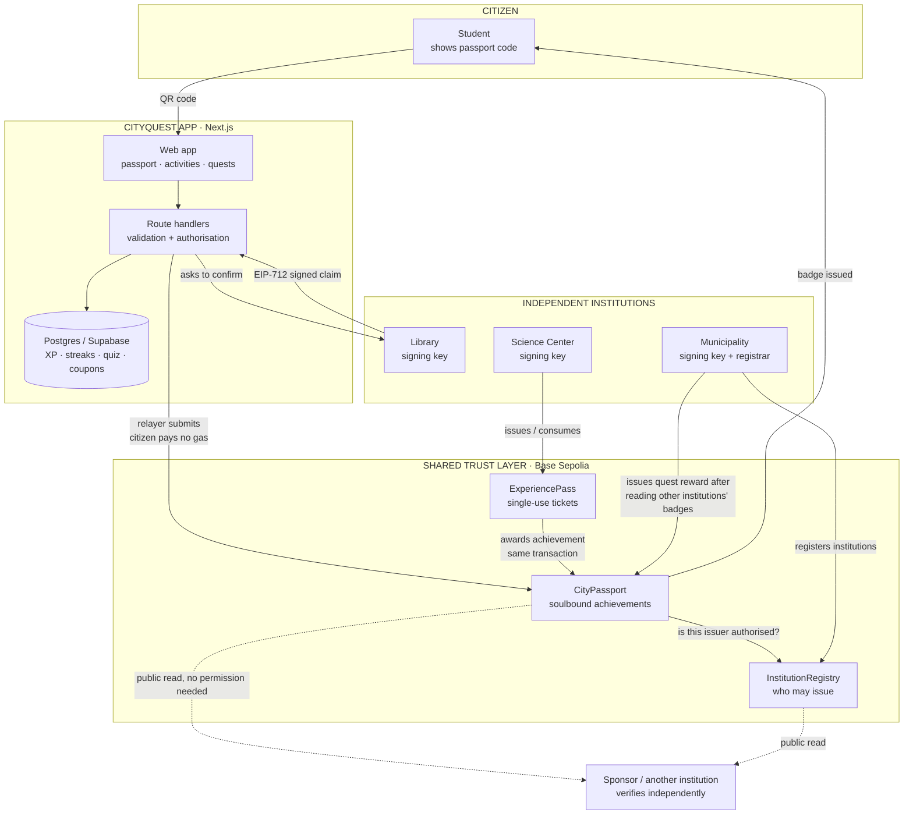

# CityQuest — A City Learning Passport

> **"If there were only one institution, we wouldn't use blockchain."**

CityQuest lets a student collect verified achievements from the libraries, science centers,
museums and workshops around their city, and carry them in one portable passport that no single
organisation owns.

It runs on **Base Sepolia** (testnet only, no real funds).

---

## Problem

A city already runs dozens of educational programmes. A library has a summer reading club, a
science center runs an earthquake simulation, the municipality runs robotics workshops, a
university runs open lectures. Each of them tracks attendance in its own spreadsheet or its own
app.

The consequences are dull but real:

- A student's record is scattered across organisations that cannot read each other's data.
- When a sponsor wants to reward "students who completed three science activities", nobody can
  answer the question without a data-sharing agreement between five institutions.
- When an app is decommissioned, the achievements inside it disappear.
- The institution that builds the software becomes the gatekeeper for everyone else's records.

## Solution

A shared achievement layer that no participant owns.

An institution confirms something a citizen did by **signing a claim**. The claim is submitted to
a public registry that checks two things: is this institution authorised, and has this exact
person already been credited for this exact thing in this period? If both pass, the citizen's
passport gains a badge that names who vouched for it.

Any other institution — this year or in ten years, with or without our app — can verify that
badge by reading the chain.

---

## Why Web3

The honest version, because it is the more convincing one:

> **This system does not need a blockchain to store points.** If a single municipality controlled
> every library, museum and science center, a normal Postgres database would be simpler, faster,
> cheaper and better. We would use one, and we would be right to.

The reason we do not is that the ecosystem contains **independent institutions**. A library, a
university, a private science center and a municipality are separate legal entities with separate
budgets and separate IT. They need to issue and verify each other's achievements without one of
them hosting the database that all the others depend on.

Blockchain here is doing one specific job: it is the **shared verification and trust layer between
organisations that do not report to each other.**

Three concrete things follow from that, and each of them is implemented:

1. **A shared list of who is allowed to issue.** `InstitutionRegistry` is readable by anyone and
   writable only by the municipality. A museum can check whether a credential came from a real
   library without phoning the library.
2. **Composability across institutions.** When the municipality issues `YOUNG_SCIENTIST`, the
   backend checks the prerequisites *on-chain* — the library's and the science center's
   credentials — not in our own database. See [`quests/claim`](web/src/app/api/quests/claim/route.ts).
3. **Records that outlive the app.** The badge is a soulbound ERC-721 with public metadata. If
   this project is switched off tomorrow, a student's achievements are still verifiable.

### Why not a normal database?

| Question | Normal database | This design |
|---|---|---|
| Who can issue an achievement? | Whoever has a write credential to the DB | Only addresses the municipality registered on-chain |
| Can a museum verify a library's badge? | Only through an integration the library agrees to build | Yes, by reading a public contract |
| What happens when the vendor shuts down? | The records are gone | The records remain |
| Can the host silently edit history? | Yes | No — issuance and revocation are public events |
| Do we need it for XP and leaderboards? | **No — and we don't use it for those** | XP, streaks and quiz scores are in Postgres |

We put on-chain only the part that a single database genuinely cannot do.

### What this project is *not*

- **Not a token.** There is no ERC-20, no tokenomics, no tradable asset, no speculation.
- **Not "go somewhere and earn crypto".** Learning points are ordinary database rows and cannot be
  transferred between people.
- **Not a surveillance system.** See [Privacy decisions](#privacy-decisions).

---

## Architecture



### The flow that matters

```
CITIZEN shows QR
        ↓
INSTITUTION operator scans it
        ↓
INSTITUTION BACKEND signs EIP-712 claim   ← authority lives here
        ↓
RELAYER submits the transaction           ← gas lives here
        ↓
SMART CONTRACT verifies
        · signature is really from that institution
        · institution is authorised in the registry
        · claim has not expired
        · this person+place+achievement+day was not already used
        ↓
ACHIEVEMENT issued, off-chain XP awarded
```

The separation of **authority** (the institution's signature) from **payment** (the relayer's gas)
is what makes the citizen experience possible. A twelve-year-old collects a verified credential
without owning cryptocurrency, seeing a wallet popup, or knowing a blockchain was involved.

---

## On-chain vs off-chain

**On-chain** — only things that need independent verification:

| What | Where | Why |
|---|---|---|
| Which institutions may issue | `InstitutionRegistry` | Every participant must agree on this list |
| Achievement ownership | `CityPassport` | Must be verifiable without our app |
| Who issued an achievement | `CityPassport` | "Who says so" is the value |
| Anti-abuse record keys | `CityPassport` | Must hold even if our server is compromised |
| Revocation status | `CityPassport` | An institution must be able to withdraw its own word |
| Ticket existence and consumption | `ExperiencePass` | Must be spendable exactly once |

**Off-chain** — everything else:

XP · levels · streaks · quiz questions and scores · leaderboards · display names and avatars ·
institution descriptions, districts and artwork · activity copy · quest definitions · sponsor
campaigns · coupon codes · analytics.

Note the deliberate asymmetry: **XP is off-chain, but the proof that an institution vouched for you
is on-chain.** Points are a game mechanic that only this app cares about. The credential is a claim
about the real world that other organisations need to check.

---

## Privacy decisions

Some of the people using this are eleven years old. A permanent, public, queryable record of where
a child goes after school would be an unacceptable thing to build.

**What is never stored on-chain:** names, ages, schools, phone numbers, email addresses, home
addresses, precise timestamps, venue coordinates, or visit histories.

**Specific choices made in the contracts:**

- **Timestamps are day-granular, not second-granular.** `Credential.issuedAtDay` holds days since
  the epoch. "Library Visitor since March" is useful; "was at the library at 16:32" is
  surveillance. The precision simply does not exist in storage.
- **Attendance is stored as an opaque hash, not a record.** A verified visit is
  `mapping(bytes32 => bool)` keyed by `keccak256(recipient, institution, credentialType, periodId)`.
  Contract state reveals nothing to someone who does not already know all four inputs.
- **Events name the hash, not the person.** `ActivityVerified(bytes32 recordKey, bytes32 type)`
  carries no wallet and no venue, so the logs cannot be trawled to reconstruct a child's week.
- **One badge, not a trail.** Visiting the library every week for a year produces exactly one
  `LIBRARY_VISITOR` badge. The chain never accumulates a visit-by-visit history.
- **The database holds no personal data either.** A display name and an emoji, both chosen by the
  user. No age, school, phone or email — see [`0001_init.sql`](web/supabase/migrations/0001_init.sql).

**Known limitation, stated plainly:** transaction *calldata* is public. While a claim is being
submitted, the recipient address, institution and day number are visible to anyone reading the
mempool or the transaction history. Persistent state and event logs are minimised as described
above, but this is a real gap and the honest fix is cryptographic, not architectural.

**The upgrade path.** The design is deliberately shaped so a zero-knowledge version is a drop-in
replacement rather than a rewrite: the contract's entire input is one signed claim, so
`verifyActivity(claim, signature)` can become `verifyActivity(proof)` where the proof asserts
*"an authorised institution signed a claim for me, and this record key is unspent"* without
revealing the institution, the recipient or the day. Selective disclosure — proving "I completed at
least four educational activities this month" without naming which — is then a matter of what the
circuit asserts, and none of the surrounding application changes.

---

## User flow

1. Tap **Start Your City Passport**. A passport identity is created on the device — no extension,
   no seed phrase, nothing to pay.
2. Open the passport and tap **Show my code** at the library desk.
3. A librarian scans it. Achievement appears, +10 XP.
4. Come back the same day — politely refused. Come back tomorrow — accepted, and no duplicate badge.
5. Book the Earthquake Experience (demo checkout, 50 TL). A ticket appears, marked **VALID**.
6. The science center scans the ticket. It becomes **USED**, and the achievement arrives in the same
   transaction.
7. Pass the science quiz for off-chain XP.
8. The Science Quest is now complete — claim **🏆 Young Scientist** from the municipality.
9. Demo Café's reward unlocks. Claim an ordinary coupon code.

## Institution flow

Staff open `/institution`, choose their institution and sign in. They get one screen with two jobs:
**confirm a visitor** and **validate a ticket**. Both accept a camera scan or a typed code, and both
report the outcome in large, plain language — including *why* something was refused.

The institution's signing key never reaches the browser. Signing happens server-side; the operator
console only ever calls an API route.

---

## Smart contracts

All three are in [`contracts/src`](contracts/src).

### `InstitutionRegistry.sol`
The shared list of who may issue achievements. `AccessControl`-based: only `REGISTRAR_ROLE` (the
municipality) can register or suspend, but `isAuthorizedInstitution()` is public. Suspending an
institution stops it issuing anything new; achievements it already issued stay valid, because
withdrawing those is a separate and deliberate act.

### `CityPassport.sol`
Soulbound ERC-721 achievements, issued from EIP-712 signed claims.

Two distinct things happen here:

- An **activity verification** is a one-shot record that an institution confirmed something. It is
  a single boolean under an opaque hash.
- A **credential** is the badge the citizen carries. It is minted the first time a matching activity
  is verified and never duplicated afterwards.

Token ids are deterministic — `uint256(keccak256(holder, credentialType))` — so anyone can check a
credential without an indexer, and `hasCredential()` is a single cheap read.

**One mechanism enforces both anti-abuse rules.** The record key is
`keccak256(recipient, institution, credentialType, periodId)`:

- `periodId = dayNumber` → once per person, per place, per day (the library rule).
- `periodId = 0` → once ever (non-repeatable achievements).

A freshly signed claim does not defeat it, because the key contains no nonce. There is deliberately
no separate "used nonce" mapping: the nonce sits inside the signed digest, so a signature is already
bound to exactly one claim, and the record key is the stronger, semantic guarantee.

Signatures are checked with OpenZeppelin's `SignatureChecker`, so an institution can move from a
single key to a multisig later without redeploying anything.

### `ExperiencePass.sol`
Non-transferable single-use tickets. Only the issuing institution can consume one, and consumption
awards the achievement **in the same transaction** — so an operator can never burn a ticket without
the visitor getting credit. Money never touches this contract; payment happens in ordinary currency
through ordinary payment rails.

### Tests

56 Foundry tests covering the security-relevant behaviour:

```
contracts/test/InstitutionRegistry.t.sol   11 tests
contracts/test/CityPassport.t.sol          28 tests
contracts/test/ExperiencePass.t.sol        17 tests
```

Including: unauthorised issuers rejected · signatures from the wrong key rejected · tampered claims
rejected · expired claims rejected · same claim not usable twice · leaving and re-entering the
library the same day rejected even with a fresh signature · next-day visits accepted without
duplicating the badge · one-time credentials not re-earnable · tickets consumable exactly once ·
another venue cannot spend a ticket · credentials and tickets non-transferable · revocation limited
to the issuer or an admin · a suspended institution cannot issue.

```bash
cd contracts && forge test -vv
```

---

## Tech stack

| Layer | Choice |
|---|---|
| Contracts | Solidity 0.8.28, Foundry, OpenZeppelin 5.7 |
| Network | Base Sepolia (testnet only) |
| Frontend | Next.js 16 (App Router), React 19, TypeScript (strict), Tailwind CSS v4 |
| Chain client | viem |
| Backend | Next.js route handlers, Zod validation |
| Database | Supabase / Postgres, with a zero-config local fallback |

### Two deliberate deviations from the brief

**1. viem without wagmi.** wagmi exists to manage wallet connectors and user-signed transactions.
In this design a citizen never sends a transaction — the institution signs and a relayer submits —
so the only wallet operation in the entire app is signing one sign-in message. wagmi's connector
and transaction machinery would be unused weight. The wallet layer is isolated behind a single
small interface in [`features/auth/wallet.ts`](web/src/features/auth/wallet.ts) with two
implementations (device key, browser wallet), so swapping in wagmi or a passkey smart account later
is a one-file change.

**2. The database falls back to a JSON file.** When `SUPABASE_URL` is unset, the app uses a local
JSON store so a fresh clone runs with zero provisioning and a live demo cannot fail on a missing
service. Both sit behind the same 15-method `Database` interface; the Supabase adapter and the SQL
migration are real and complete.

---

## Local development

You need Node 20+ and [Foundry](https://getfoundry.sh). Nothing else — no database, no accounts.

```bash
git clone --recursive <repo-url> && cd city-quest

# 1. Contracts
cd contracts
forge test                                   # 56 tests

# 2. Local chain, in a second terminal
anvil --block-time 1

# 3. Deploy (Anvil's well-known dev keys; safe, public, worthless)
export DEPLOYER_PRIVATE_KEY=0xac0974bec39a17e36ba4a6b4d238ff944bacb478cbed5efcae784d7bf4f2ff80
forge script script/Deploy.s.sol --rpc-url http://127.0.0.1:8545 --broadcast

# 4. Web app
cd ../web
npm install
cp .env.local.example .env.local     # pre-filled for Anvil; addresses are deterministic
npm run dev
```

Open http://localhost:3000.

Demo sign-in codes: institution staff `1234`, municipality `cityquest`.

### Verifying the whole demo without clicking

```bash
cd web && npm run demo:e2e
```

This drives every step of the demo journey against the running app and the real chain — sign-in,
library check-in, the same-day refusal, ticket purchase and consumption, ticket reuse refusal, the
quiz, the quest, the sponsor coupon, and institution suspension. It asserts each outcome and exits
non-zero on failure.

### After changing a contract

```bash
cd contracts && forge build
cd ../web && npm run sync:abis
```

---

## Environment variables

See [`web/.env.example`](web/.env.example). Summary:

| Variable | Purpose |
|---|---|
| `NEXT_PUBLIC_CHAIN_ID` | `84532` for Base Sepolia, `31337` for Anvil |
| `NEXT_PUBLIC_RPC_URL` | RPC endpoint |
| `NEXT_PUBLIC_EXPLORER_URL` | Explorer base, for "View on explorer" links |
| `NEXT_PUBLIC_INSTITUTION_REGISTRY_ADDRESS` | Registry address |
| `NEXT_PUBLIC_CITY_PASSPORT_ADDRESS` | Passport address |
| `NEXT_PUBLIC_EXPERIENCE_PASS_ADDRESS` | Ticket address |
| `RELAYER_PRIVATE_KEY` | Pays gas; also the municipality admin. Holds no authority of its own |
| `LIBRARY_SIGNER_PRIVATE_KEY` | Library's signing key |
| `SCIENCE_CENTER_SIGNER_PRIVATE_KEY` | Science center's signing key |
| `MUNICIPALITY_SIGNER_PRIVATE_KEY` | Municipality's signing key |
| `SESSION_SECRET` | Signs session cookies |
| `OPERATOR_PIN` / `ADMIN_PIN` | **Demo mock** staff sign-in codes |
| `SUPABASE_URL` / `SUPABASE_SERVICE_ROLE_KEY` | Optional; omit to use the local JSON store |

**Never commit private keys.** The keys in the committed `.env.local` are Anvil's published
development keys, which are worthless by design and must never be used on a real network.

---

## Deployment

### Base Sepolia

```bash
cd contracts

export DEPLOYER_PRIVATE_KEY=0x...            # funded with Base Sepolia ETH
export LIBRARY_SIGNER_ADDRESS=0x...
export SCIENCE_CENTER_SIGNER_ADDRESS=0x...
export MUNICIPALITY_SIGNER_ADDRESS=0x...
export APP_BASE_URL=https://your-app.vercel.app

forge script script/Deploy.s.sol \
  --rpc-url https://sepolia.base.org \
  --broadcast --verify
```

The script deploys all three contracts, grants `ExperiencePass` the credential-issuer role,
registers the three demo institutions, and tops each institution up with a small amount of gas
(institutions send their own transactions when issuing and consuming tickets; credential issuance
is relayed, so citizens never need funds). Addresses are printed and written to
`contracts/deployments/<chainId>.json`.

Copy them into `web/.env.local`, then deploy the web app anywhere that runs Next.js.

### Database

Optional. To use Postgres instead of the local JSON store, run
[`web/supabase/migrations/0001_init.sql`](web/supabase/migrations/0001_init.sql) in your Supabase
project and set `SUPABASE_URL` and `SUPABASE_SERVICE_ROLE_KEY`.

---

## Demo scenario

The five-minute version:

| # | Action | What to point at |
|---|---|---|
| 1 | Open `/`, read the hero line aloud | The argument, stated before any technology |
| 2 | **Start Your City Passport** | No wallet, no seed phrase, no gas. One tap |
| 3 | `/passport` — empty | 0 XP, no achievements |
| 4 | `/institution` → library, code `1234`, scan the citizen | An institution vouching, cryptographically |
| 5 | Passport now shows **📚 Library Visitor · Verified by Selcuklu Library** | The issuer is as prominent as the achievement |
| 6 | Scan the same person again | *"This visit is already verified for today."* Enforced on-chain, not by our server |
| 7 | Book the Earthquake Experience, 50 TL | Payment is mocked and stays off-chain, by design |
| 8 | Science center scans the ticket | **VALID → USED**, achievement issued in the same transaction |
| 9 | Scan the ticket again | Refused. A screenshot is worthless |
| 10 | Take the science quiz | Off-chain XP, and the UI says so: *"Scored by the city app"* |
| 11 | `/quests` → claim **🏆 Young Scientist** | The municipality read the *library's* and the *science center's* badges on-chain before signing |
| 12 | `/rewards` → free hot chocolate | A sponsor rewarding verified behaviour. A coupon, not a coin |
| 13 | `/admin` → suspend the library, retry step 4 | The registry is what makes an institution's word count |
| 14 | Open **Technical details** anywhere | The chain was there the whole time, and never once in the way |

---

## Future improvements

- **Zero-knowledge claims** — prove "an authorised institution vouched for me" without revealing
  which institution, which person, or which day. The contract already takes a single signed claim
  as its entire input, so this is a substitution rather than a redesign.
- **Selective disclosure** — "completed at least four activities this month" with nothing else
  revealed.
- **Passkey smart accounts and a paymaster** — replace the device key with a recoverable
  passkey-backed account. One file changes ([`wallet.ts`](web/src/features/auth/wallet.ts)).
- **Real institution identity** — staff SSO or kiosk device certificates instead of the demo PIN;
  signing keys in an HSM, held by each institution rather than by this app.
- **W3C Verifiable Credentials and DIDs** — express achievements in a standard schema so they
  interoperate outside this ecosystem.
- **Multi-city federation** — several municipalities, one credential vocabulary; a student moving
  from Konya to Izmir keeps their passport.
- **NFC turnstiles** for check-in without a phone.
- **School and university integrations** so achievements can count towards coursework.

---

## Project structure

```
contracts/
  src/
    InstitutionRegistry.sol     who may issue
    CityPassport.sol            soulbound achievements + EIP-712 claims
    ExperiencePass.sol          single-use tickets
    CredentialTypes.sol         canonical achievement identifiers
  test/                         56 Foundry tests
  script/Deploy.s.sol           deploy + seed the demo city

web/
  src/
    app/                        pages and route handlers
    components/                 UI primitives
    features/                   auth, passport, activities, quests, rewards, institution, admin
    lib/                        chain clients, credential catalogue, QR, env
    server/                     database, sessions, signing, transactions
  supabase/migrations/          SQL schema
  scripts/
    sync-abis.mjs               contract ABIs → typed TS
    demo-e2e.mjs                scripted run-through of the whole demo
```

---

## Licence

MIT. Educational demonstration project — testnet only, never intended to hold real funds.
